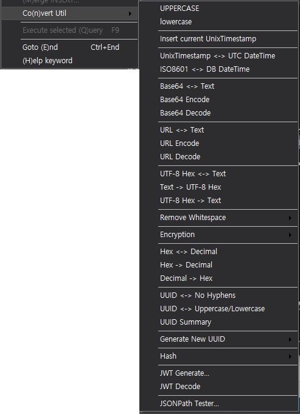
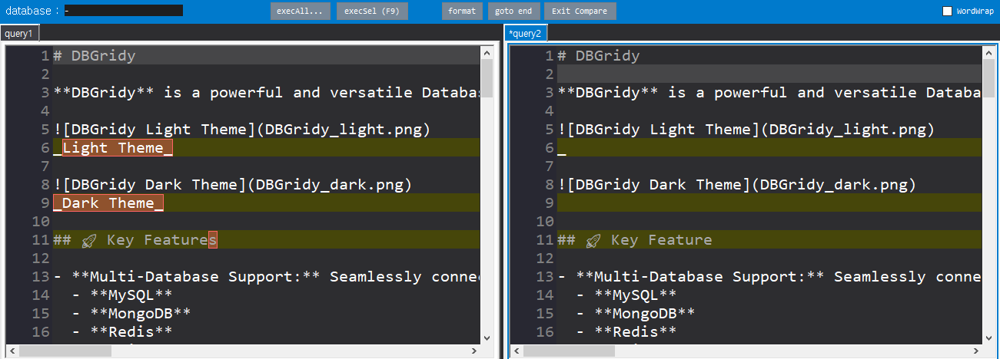

# DBGridy

**DBGridy** is a powerful and versatile Database Grid Editor designed for Windows. It provides a unified interface to manage and edit data across multiple database systems, bridging the gap between SQL and NoSQL environments.

_Light Theme_

_Dark Theme_

## 🚀 Key Features

- **Multi-Database Support:** Seamlessly connect to and manage:
  - **MySQL**
  - **MongoDB**
  - **Redis**
  - **ClickHouse**
  - **MS-SQL (SQL Server)**
  - **PostgreSQL**
  - **SQLite**
- **Grid-Based Editing:** Edit database records directly within a user-friendly grid interface.
- **Advanced Query Editor:**
  - Syntax highlighting for SQL, JSON, and more.
  - Multiple query tabs for multitasking.
  - "Merge INSERT Statements" tool to optimize bulk data operations.
- **Visualization:**
  - **JSON Formatting:** Built-in pretty-print for JSON data.
  - **Theme Support:** Choose between Light and Dark themes for visual comfort.
- **Data Management:**
  - Export data to CSV, SQL or JSON.
  - Blob to Hex conversion.
  - Visual Tree View for database schemas and Redis keys.

### 🛠 Utility Tools
A comprehensive collection of developer tools has been added to the **"Convert Util"** menu to assist with data manipulation and inspection directly within the editor:

#### Text & Case Transformation
* **Case Conversion**: Quickly convert text to **UPPERCASE** or **lowercase**.
* **Whitespace Management**: Added "Remove Whitespace" utility.

#### Date & Time Operations
* **Unix Timestamp**: Insert current UnixTimestamp and convert between UnixTimestamp <-> UTC DateTime.
* **Date Formats**: Convert between ISO8601 <-> DB DateTime formats.

#### Encoding & Decoding
* **Base64**: Support for Base64 Encode, Decode, and toggling between Text <-> Base64.
* **URL**: Support for URL Encode, Decode, and toggling between Text <-> URL.
* **UTF-8**: Bidirectional conversion between Text <-> UTF-8 Hex.

#### Numeric & Data Conversion
* **Hex/Decimal**: Convert values between Hex <-> Decimal.

#### UUID Management
* **Generation**: Generate New UUIDs instantly.
* **Formatting**: Toggle UUIDs between "No Hyphens" and "Uppercase/Lowercase" formats.
* **Inspection**: View UUID Summary.

#### Security, Web & Developer Tools
* **JWT Tools**: Full support for **JWT Generate** and **JWT Decode**.
* **Encryption & Hash**:
    * **AES Encrypt/Decrypt**: Encrypt and decrypt text using AES.
    * **Hash**: Generate hash values.
* **JSON**: **JsonPath Tester** to evaluate expressions against JSON data.

### 🛠 Compare Mode

- **Character-Level Diff Highlighting**
  - Differences are now highlighted at the character level, including whitespace (spaces and tabs)
  - Uses distinct colors for added (green) and removed (red) characters

- **Line Copy Between Editors**
  - Alt+Right: Copy current line from left editor to right editor
  - Alt+Left: Copy current line from right editor to left editor

- **Diff Navigation**
  - Alt+Up: Navigate to previous difference
  - Alt+Down: Navigate to next difference

- **Manual Refresh**
  - F5: Manually refresh diff comparison (replaces auto-refresh on line change)

### 🛠 Tab Management Improvements

- **Right Panel Tab**
  - Added functionality to move query tabs to the right panel.

---

## 📥 Installation & Requirements

- **OS:** Windows (WinForms Application)
- **Framework:** .NET 6.0 or later (depending on build)
- **Installation:** simply download the release, unzip, and run `DBGridy.exe`.

## 📄 License

**DBGridy** is proprietary software.

- ✅ **Permitted:** Personal use, Educational use, Internal business use (management/development).
- ❌ **Prohibited:** Commercial redistribution, Resale, SaaS, Modification, Reverse engineering.

See the LICENSE.txt file for full details.

---

https://dbgridy.com

_Copyright © 2025 BrianMSon. All Rights Reserved._

